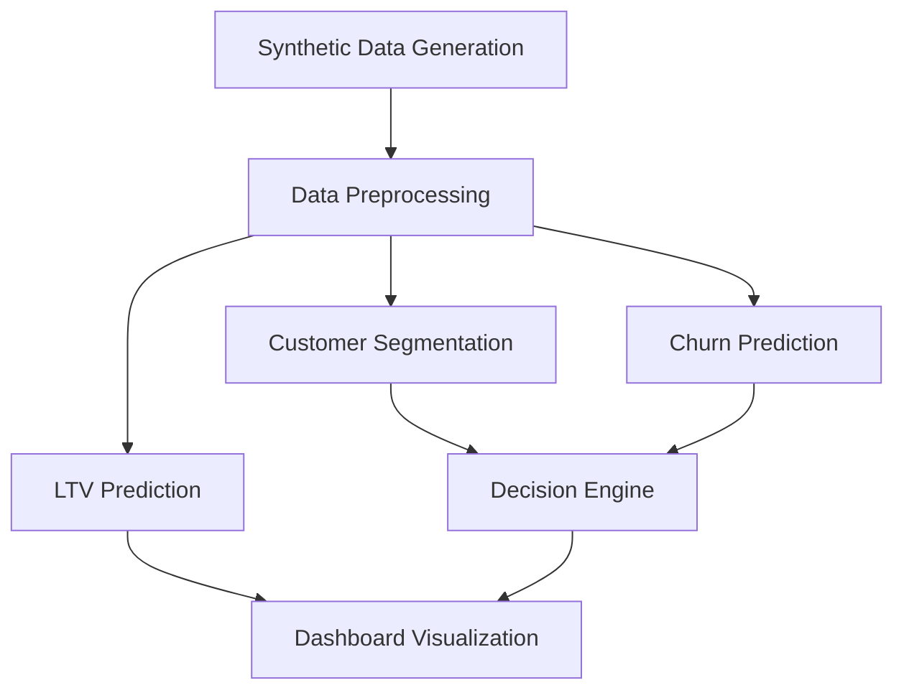

# 🛒 E-Commerce Customer Retention & LTV — ML Pipeline Visualizer

<p align="center">
  
  
  
  
</p>

<p align="center">
  An interactive machine learning dashboard for predicting customer churn, estimating lifetime value (LTV), segmenting customers, and generating automated retention strategies.
</p>

<p align="center">
  🚀 **[Live Demo](https://e-commerce-retention-ltv-ml-pipeline-visualizer-xyvnunsfj22n9b.streamlit.app/)**
</p>

## 🧰 Tech Stack

* **Language:** Python
* **Dashboard:** Streamlit
* **Machine Learning:** Scikit-Learn
* **Data Processing:** Pandas, NumPy
* **Visualization:** Plotly
* **Models:** K-Means, Logistic Regression, Ridge Regression
* **Model Storage:** Joblib
* **Testing:** Streamlit AppTest, Python Unit Tests
* **Deployment:** Streamlit Community Cloud

## 📌 Overview

This project simulates an end-to-end ML pipeline using 1,000 synthetic e-commerce customers. It predicts churn probability, estimates customer lifetime value, identifies behavioral customer segments, and recommends personalized retention actions.

The dashboard features animated pipeline execution, timestamped terminal logs, interactive visualizations, and automated decision-making.

## 🔄 Project Workflow



| Stage | Process          | Description                                                                         |
| ----- | ---------------- | ----------------------------------------------------------------------------------- |
| 1     | Data Generation  | Generate 1,000 customers with approximately 25% churn and 5% missing feature values |
| 2     | Preprocessing    | Median imputation and StandardScaler                                                |
| 3     | Segmentation     | K-Means clustering into three customer groups                                       |
| 4     | Churn Prediction | Logistic Regression predicts churn probability                                      |
| 5     | LTV Prediction   | Ridge Regression estimates customer lifetime value                                  |
| 6     | Decision Engine  | Recommends retention actions based on churn risk and customer segment               |

### 👥 Customer Segments

* **0 — At-Risk Bargain Hunters**
* **1 — Consistent Mid-Tier**
* **2 — VIP High Spenders**

### 🎯 Retention Strategies

| Condition                | Action                |
| ------------------------ | --------------------- |
| Churn > 0.70 and At-Risk | 15% Discount Voucher  |
| Churn > 0.70 and VIP     | Priority VIP Outreach |
| Otherwise                | No Action             |

## 📊 Dashboard Features

* Animated ML pipeline with live logs and progress bars.
* Interactive 2D/3D customer clustering visualizations.
* Pulsing target customer animation.
* Churn probability gauge.
* Predicted LTV vs. historical average.
* Automated retention decision banner.
* Model evaluation with ROC-AUC, confusion matrix, RMSE, and MAE.
* Manual customer input and test-set sample selection.

## 📁 Project Structure

```text
├── app.py
├── pipeline.py
├── data_generator.py
├── data/
│   └── synthetic_customers.csv
├── models/
│   └── pipeline_models.joblib
├── test_app_smoke.py
├── test_edge_cases.py
├── test_decision_rules.py
├── requirements.txt
└── README.md
```

## ⚙️ Installation and Execution

**1. Clone the repository**

```bash
git clone <your-repository-url>
cd e-commerce-retention-ltv-ml-pipeline-visualizer
```

**2. Install dependencies**

```bash
pip install -r requirements.txt
```

**3. Generate data and train models (optional)**

```bash
python data_generator.py
python pipeline.py
```

**4. Run the dashboard**

```bash
streamlit run app.py
```

The application automatically generates the dataset and trains the models on first launch if required.

## 🧪 Testing

```bash
python test_decision_rules.py
python test_app_smoke.py
python test_edge_cases.py
```

Tests cover decision rules, dashboard rendering, pipeline execution, missing-value handling, and manual customer inputs.

## 📈 Expected Model Performance

| Model               | Metric  | Approximate Result |
| ------------------- | ------- | ------------------ |
| Logistic Regression | ROC-AUC | 0.79               |
| Ridge Regression    | RMSE    | $145               |

*Results are approximate and based on synthetic data.*

## 🚀 Future Enhancements

* Real-world e-commerce dataset integration.
* Advanced churn prediction models.
* Explainable AI using SHAP.
* Customer analytics and campaign optimization.
* Model monitoring and automated retraining.

---

<p align="center">
  ⭐ Built with Python, Machine Learning, Streamlit & Plotly
</p>
